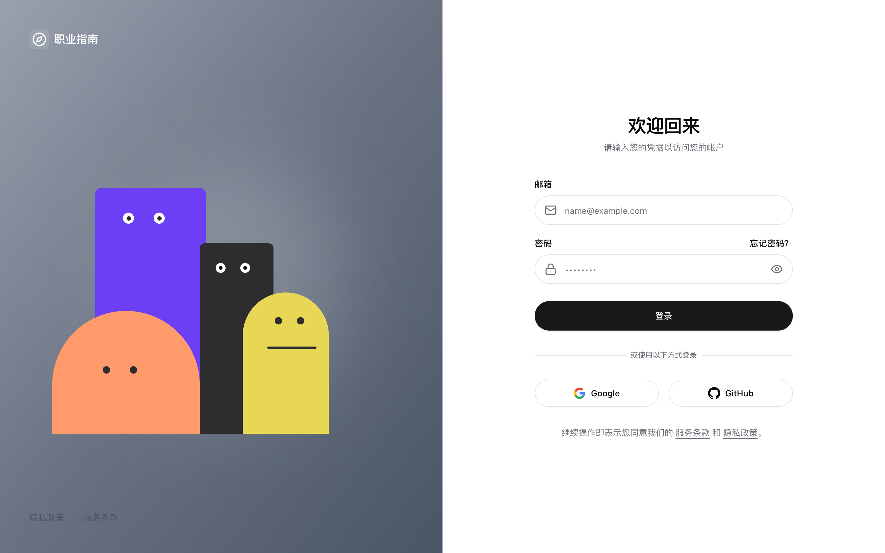

# 🎨 Interactive Animated Login Page

> A modern, highly interactive login page featuring responsive cartoon characters that follow your cursor and react to your input interactions in real-time. 

**[🔗 Live Demo / 在线预览](https://login-page-tan-eight.vercel.app/)**

## ✨ Features / 特性
- 🖱️ **Mouse Follow**: Characters dynamically track your cursor movement.
- ⌨️ **Input Interaction**: 
  - Characters lean forward curiously when typing email.
  - Characters playfully hide their eyes when typing password.
  - Characters take random peeks when showing the password.
- 🎨 **Modern UI**: Clean, responsive split-screen design.

## 📸 Preview / 预览截图



## 🛠️ Tech Stack / 技术栈
- React 18
- TypeScript
- Vite
- Tailwind CSS v4
- Framer Motion

## Quick Start

```bash
# Install dependencies
npm install

# Start development server
npm run dev

# Build for production
npm run build
```